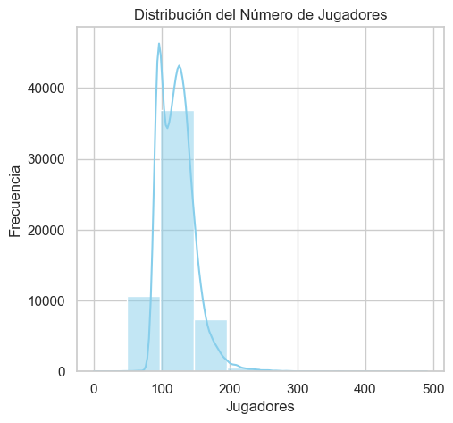
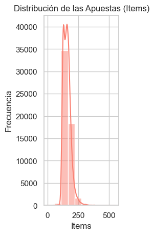
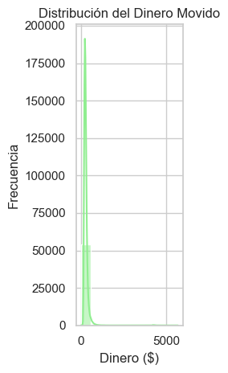
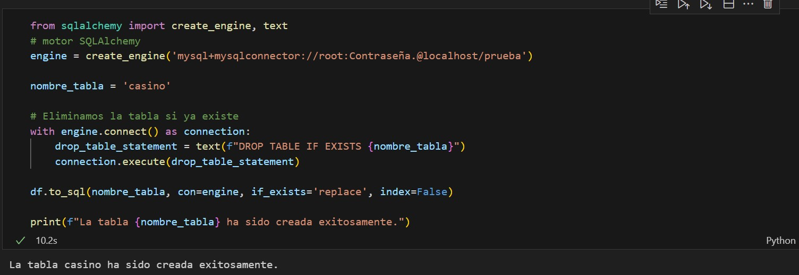
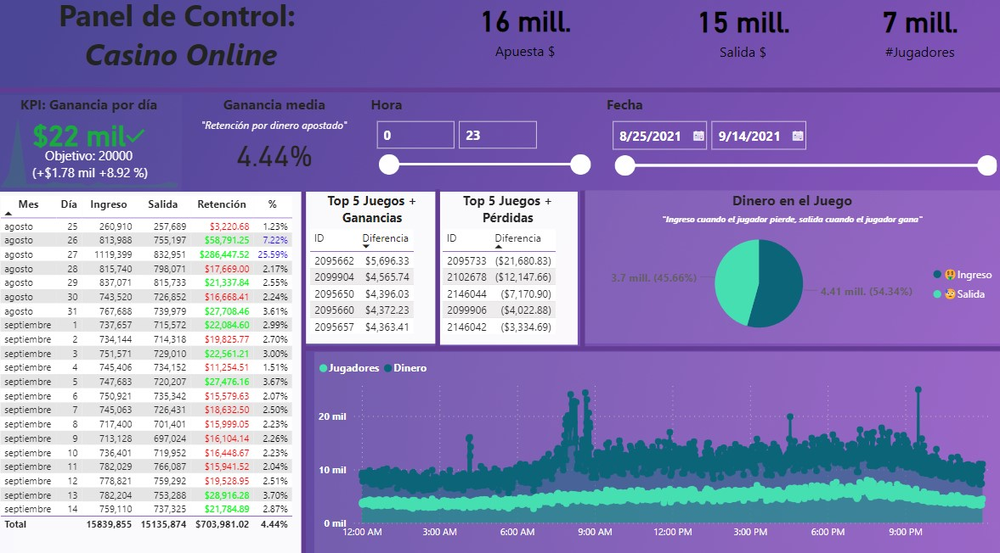

# **CASINO ONLINE**

Este conjunto de datos contiene información que he obtenido de la conexión abierta del casino en línea. Este casino opera con artículos virtuales de juegos. En este proyecto, analizaremos diversos aspectos de las partidas, incluyendo la cantidad de jugadores, el dinero apostado, y las ganancias y pérdidas, para obtener una visión más clara del funcionamiento y rendimiento del casino
<!--  -->
_Puedes encontrar la fuente BD aqui: <a href ="https://www.kaggle.com/datasets/andreylovyagin/online-unfair-casino?resource=download">Link_

### __Recursos__
- Kagle
- Python
- MySQL
- Power BI

#### __Librerías__
- Pandas
- Matplotlib
- Seaborn

**PASOS**
__1. Extracción y Limpieza:__ Se empleo python para visualizar la data, y así ver la naturaleza de cada variable (atributo). Se pudo identificar que cada fila corresponde a un juego, es decir se está trabajando con una tabla resumen. A partir de ello, se procede a visualizar distribución de las variables de interés:
- __Distribución de Jugadores:__

- __Distribución de items empleados por juego:__

- __Distribución de dinero apostado:__

Con el fin de conocer el rango en el cual se mueven y definir métricas.

Se procedió a ingestar la base a MySQL para mantener la tabla y poder hacer consultas relacionadas al negocio.

__2. Se procedió con las consultas.__

__3. Creación de panel de control en Power BI__

Se propuso un KPI: Ganancia por día mayor a 20,000 dólares.
A partir del KPI propuesto se trabajó el panel de contro; obteniendo:
- 16 Millones de dólares de ingreso al casino online (Money)
- 15 Millones de dólares de egreso del casino online (Outpay)
- 7 Millones de jugadores en el casino online
- Ganancia media de 4.44 %, es decir el dinero retenido por cada dolar utilizado
- De los 21 días con el cual se está trabajando solo el 9 días se pudo superar la meta de los 20K $
- Se obtuvo los 5 juegos con mas ganancias; así como, los 5 juegos con más pérdidas para el casino.
- La proporción de dinero a favor del casino (peopleLost) en comparación a dinero en contra del casino (peopleWin) es mayor en solo un 9%
- Respecto al uso de los juegos en el casino, se encuentran picos a las 4 am, 8 am, 4 pm y 9 pm

